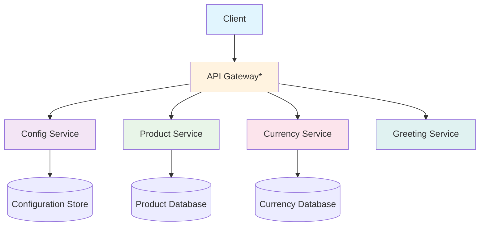

# 🛒 Micro Services E-commerce Application

<div align="center">


**Aplicação de e-commerce desenvolvida com arquitetura de microserviços**

*Demonstrando a separação de responsabilidades em serviços independentes e escaláveis*

[🚀 Quick Start](#️-como-executar) • 
[📖 Documentação](#-endpoints-da-api)

</div>

---

## 🎯 Sobre o Projeto

Esta aplicação demonstra a implementação de um **sistema de e-commerce** utilizando **arquitetura de microserviços** com **Spring Boot**. Cada serviço é independente e focado em uma responsabilidade específica do domínio, proporcionando:

- ✅ **Escalabilidade** independente por serviço
- ✅ **Manutenção** simplificada 
- ✅ **Desenvolvimento** paralelo por equipes
- ✅ **Tecnologias** específicas por contexto

## 🏗️ Arquitetura dos Serviços



### 📦 Serviços Disponíveis

| Serviço | Descrição | Porta* | Status |
|---------|-----------|--------|--------|
| **🔧 Config Service** | Centralizador de configurações | `8888` | ✅ |
| **💰 Currency Service** | Gerenciamento de moedas e câmbio | `8100` | ✅ |
| **👋 Greeting Service** | Serviço de saudação (demo) | `8080` | ✅ |
| **📦 Product Service** | Catálogo e gestão de produtos | `8000` | ✅ |

> *Portas padrão - configuráveis via application.properties

## ⚙️ Stack Tecnológica

### Core
- **☕ Java 21+** - Linguagem principal
- **🍃 Spring Boot 3.x** - Framework base
- **🔗 Spring Cloud Config** - Configuração centralizada
- **📦 Maven** - Gerenciamento de dependências

### Banco de Dados
- **🗄️ H2 Database** (desenvolvimento)
- **🐘 PostgreSQL** (produção - futuro)

### DevOps & Observabilidade
- **🐳 Docker** (planejado)
- **📊 Actuator** - Health checks e métricas
- **📝 Logback** - Sistema de logs

## 🛠️ Pré-requisitos

Antes de começar, certifique-se de ter instalado:

```bash
☕ Java 21+ (OpenJDK recomendado)
📦 Maven 3.8+
🐙 Git
```

**Verificação rápida:**
```bash
java --version
mvn --version
git --version
```

## ▶️ Como Executar

### 1. 📥 Clone o Repositório
```bash
git clone https://github.com/AndersonBohnem/micro-services-application.git
cd micro-services-application
```

### 2. 🔨 Compile Todos os Serviços
```bash
mvn clean install
```

### 3. 🚀 Execute os Serviços

#### Opção A: Execução Individual
```bash
# 1. Config Service (SEMPRE PRIMEIRO!)
cd config-service
mvn spring-boot:run

# 2. Em terminais separados, execute os outros serviços:
cd ../product-service && mvn spring-boot:run
cd ../currency-service && mvn spring-boot:run  
cd ../greeting-service && mvn spring-boot:run
```

#### Opção B: Script de Inicialização (Recomendado)
```bash
# Criar script start-all.sh
#!/bin/bash
echo "🚀 Iniciando todos os microserviços..."

# Config service primeiro
cd config-service
mvn spring-boot:run &

sleep 10

# Outros serviços
cd ../product-service && mvn spring-boot:run &
cd ../currency-service && mvn spring-boot:run &
cd ../greeting-service && mvn spring-boot:run &

echo "✅ Todos os serviços foram iniciados!"
```

### 4. ✅ Verificar Status
Acesse: `http://localhost:8888/actuator/health` (Config Service)

## 📖 Endpoints da API

### 🔧 Config Service
```http
GET /actuator/health          # Health check
GET /actuator/info           # Informações do serviço
```

### 👋 Greeting Service  
```http
GET /greeting                # Saudação simples
GET /greeting/{name}         # Saudação personalizada
```

### 💰 Currency Service
```http
GET /currency/{from}/{to}    # Conversão de moedas
GET /currency/rates          # Todas as taxas
```

### 📦 Product Service
```http
GET    /products             # Listar produtos
GET    /products/{id}        # Buscar produto por ID  
POST   /products             # Criar produto
PUT    /products/{id}        # Atualizar produto
DELETE /products/{id}        # Remover produto
```

### 📋 Exemplo de Payload (Product)
```json
{
  "name": "Smartphone XYZ",
  "description": "Smartphone com 128GB",
  "price": 899.99,
  "category": "Electronics"
}
```

## 🧪 Testando a Aplicação

### Health Checks
```bash
curl http://localhost:8888/actuator/health  # Config
curl http://localhost:8000/actuator/health  # Product  
curl http://localhost:8100/actuator/health  # Currency
curl http://localhost:8080/actuator/health  # Greeting
```

### Testes Funcionais
```bash
# Greeting
curl http://localhost:8080/greeting

# Currency conversion  
curl http://localhost:8100/currency/USD/BRL

# Products
curl http://localhost:8000/products
```

## 🔮 Roadmap & Melhorias Futuras

### 🎯 Próximos Passos
- [ ] **🚪 API Gateway** - Ponto único de entrada
- [ ] **🔍 Service Discovery** - Eureka/Consul
- [ ] **🐳 Docker Compose** - Orquestração simplificada
- [ ] **🔐 Spring Security** - Autenticação JWT
- [ ] **📊 Observabilidade** - Logs centralizados, métricas
- [ ] **⚡ Redis Cache** - Cache distribuído

### 🏗️ Melhorias Arquiteturais
- [ ] **📨 Message Broker** - RabbitMQ/Kafka
- [ ] **🔄 Circuit Breaker** - Resilience4j
- [ ] **📝 OpenAPI/Swagger** - Documentação automática
- [ ] **🧪 Testes E2E** - TestContainers
- [ ] **📈 Monitoring** - Prometheus + Grafana

## 🐳 Docker Support (Em Breve)

```yaml
# docker-compose.yml (Preview)
version: '3.8'
services:
  config-service:
    build: ./config-service
    ports:
      - "8888:8888"
    
  product-service:
    build: ./product-service
    ports:
      - "8000:8000"
    depends_on:
      - config-service
```

## 👨‍💻 Autor

**Anderson Bohnem**

[](http://linkedin.com/in/anderson-bohnemberger)
[](https://github.com/AndersonBohnem)

---

<div align="center">

*Feito com ❤️ e ☕ por Anderson Bohnem*

</div>
