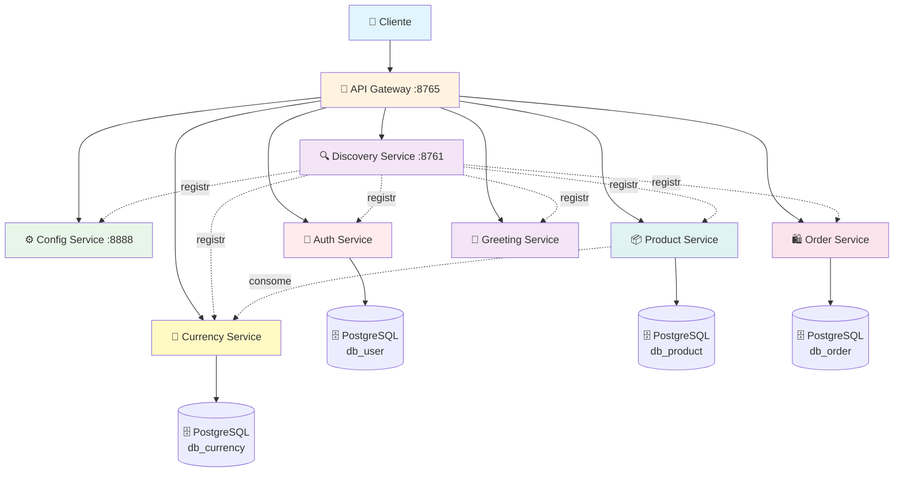

# 🛒 Micro Services E-commerce Application

<div align="center">


**Aplicação de e-commerce desenvolvida com arquitetura de microserviços**

*Demonstrando a separação de responsabilidades em serviços independentes e escaláveis*

[🚀 Quick Start](#️-como-executar) • 
[📖 Documentação](#-endpoints-da-api) •
[🏗️ Arquitetura](#️-arquitetura-dos-serviços)

</div>

---

## 🎯 Sobre o Projeto

Esta aplicação demonstra a implementação de um **sistema de e-commerce completo** utilizando **arquitetura de microserviços** com **Spring Boot** e **Spring Cloud**. Cada serviço é independente e focado em uma responsabilidade específica do domínio, proporcionando:

- ✅ **Escalabilidade** independente por serviço
- ✅ **Manutenção** simplificada 
- ✅ **Desenvolvimento** paralelo por equipes
- ✅ **Resiliência** e isolamento de falhas
- ✅ **Database per Service** pattern

## 🏗️ Arquitetura dos Serviços



### 📦 Serviços Disponíveis

#### Infraestrutura

| Serviço | Descrição | Porta | Status |
|---------|-----------|-------|--------|
| **🔍 Discovery Service** | Service Registry com Eureka | `8761` | ✅ |
| **🚪 Gateway Service** | API Gateway e roteamento | `8765` | ✅ |
| **⚙️ Config Service** | Configuração centralizada | `8888` | ✅ |

#### Domínio de Negócio

| Serviço | Descrição | Banco de Dados | Status |
|---------|-----------|----------------|--------|
| **🔐 Auth Service** | Autenticação e gerenciamento de usuários | PostgreSQL (db_user) | ✅ |
| **📦 Product Service** | Catálogo e gestão de produtos | PostgreSQL (db_product) | ✅ |
| **🛍️ Order Service** | Processamento de pedidos | PostgreSQL (db_order) | ✅ |
| **💱 Currency Service** | Conversão de moedas e câmbio | PostgreSQL (db_currency) | ✅ |
| **👋 Greeting Service** | Serviço de demonstração | - | ✅ |

## ⚙️ Stack Tecnológica

### Core
- **☕ Java 21+** - Linguagem principal
- **🍃 Spring Boot 3.x** - Framework base
- **☁️ Spring Cloud** - Infraestrutura de microserviços
  - Netflix Eureka - Service Discovery
  - Spring Cloud Gateway - API Gateway
  - Spring Cloud Config - Configuração centralizada
- **📦 Maven** - Gerenciamento de dependências

### Banco de Dados
- **🐘 PostgreSQL 16** - Banco de dados relacional

### DevOps & Observabilidade
- **🐳 Docker & Docker Compose** - Containerização e orquestração
- **📊 Actuator** - Health checks e métricas
- **📝 Logback** - Sistema de logs

## 🛠️ Pré-requisitos

Antes de começar, certifique-se de ter instalado:

```bash
☕ Java 21+ (OpenJDK recomendado)
🐳 Docker & Docker Compose
📦 Maven 3.8+
🐙 Git
```

**Verificação rápida:**
```bash
java --version
docker --version
docker-compose --version
mvn --version
git --version
```

## ▶️ Como Executar

### 1. 📥 Clone o Repositório
```bash
git clone https://github.com/AndersonBohnem/micro-services-application.git
cd micro-services-application
```

### 2. 🐳 Execute com Docker Compose (Recomendado)

```bash
# Build e inicie todos os serviços
docker-compose up -d

# Acompanhe os logs
docker-compose logs -f

# Verifique o status dos serviços
docker-compose ps
```

### 3. ✅ Verificar Status

**Eureka Dashboard (Service Discovery):**
```
http://localhost:8761
```

**API Gateway:**
```
http://localhost:8765
```

**Health Checks:**
```bash
curl http://localhost:8765/actuator/health
```

---

### Opção Alternativa: Execução Local (Sem Docker)

#### 2A. 🔨 Compile Todos os Serviços
```bash
mvn clean install
```

#### 3A. 🚀 Execute os Serviços

```bash
# 1. Discovery Service (SEMPRE PRIMEIRO!)
cd discovery-service
mvn spring-boot:run

# Aguarde 30 segundos para o Eureka inicializar completamente

# 2. Config Service
cd config-service
mvn spring-boot:run

# 3. Em terminais separados, execute os serviços de negócio:
cd auth-service && mvn spring-boot:run
cd product-service && mvn spring-boot:run
cd order-service && mvn spring-boot:run
cd currency-service && mvn spring-boot:run
cd greeting-service && mvn spring-boot:run

# 4. Gateway Service (por último)
cd gateway-service && mvn spring-boot:run
```

## 📖 Endpoints da API

### 🌐 Acesso via API Gateway

Todos os serviços devem ser acessados através do Gateway na porta `8765`:

```
http://localhost:8765/{service-name}/{endpoint}
```

### 🔍 Discovery Service (Eureka)
```http
GET http://localhost:8761              # Dashboard Eureka
```

### ⚙️ Config Service
```http
GET /actuator/health                   # Health check
GET /actuator/info                     # Informações do serviço
```

### 👋 Greeting Service  
```http
GET /greeting-service/greeting         # Saudação simples
GET /greeting-service/greeting/{name}  # Saudação personalizada
```

### 💱 Currency Service
```http
GET /currency-service/currency/{from}/{to}    # Conversão de moedas
GET /currency-service/currency/rates          # Todas as taxas
```

### 📦 Product Service
```http
GET    /product-service/products              # Listar produtos
GET    /product-service/products/{id}         # Buscar produto por ID  
POST   /product-service/products              # Criar produto
PUT    /product-service/products/{id}         # Atualizar produto
DELETE /product-service/products/{id}         # Remover produto
```

### 🔐 Auth Service
```http
POST /auth-service/register                   # Registrar usuário
POST /auth-service/login                      # Autenticar usuário
GET  /auth-service/users                      # Listar usuários
```

### 🛍️ Order Service
```http
GET    /order-service/orders                  # Listar pedidos
GET    /order-service/orders/{id}             # Buscar pedido por ID
POST   /order-service/orders                  # Criar pedido
PUT    /order-service/orders/{id}             # Atualizar pedido
DELETE /order-service/orders/{id}             # Cancelar pedido
```

### 📋 Exemplos de Payload

**Product:**
```json
{
  "name": "Smartphone XYZ",
  "description": "Smartphone com 128GB",
  "price": 899.99,
  "category": "Electronics"
}
```

**Order:**
```json
{
  "userId": 1,
  "items": [
    {
      "productId": 1,
      "quantity": 2,
      "price": 899.99
    }
  ],
  "totalAmount": 1799.98
}
```

## 🧪 Testando a Aplicação

### Health Checks (via Gateway)
```bash
curl http://localhost:8765/actuator/health
```

### Verificar Serviços Registrados
Acesse o Eureka Dashboard:
```
http://localhost:8761
```

### Testes Funcionais
```bash
# Greeting
curl http://localhost:8765/greeting-service/greeting

# Currency conversion  
curl http://localhost:8765/currency-service/currency/USD/BRL

# Products
curl http://localhost:8765/product-service/products

# Orders
curl http://localhost:8765/order-service/orders
```

## 🗄️ Banco de Dados

Cada serviço possui seu próprio banco de dados PostgreSQL, seguindo o padrão **Database per Service**:

| Serviço | Database | Porta | User | Password |
|---------|----------|-------|------|----------|
| Auth Service | db_user | 5432 | postgres | postgres |
| Product Service | db_product | 5432 | postgres | postgres |
| Order Service | db_order | 5432 | postgres | postgres |
| Currency Service | db_currency | 5432 | postgres | postgres |

*Os bancos de dados são criados automaticamente pelo Docker Compose com volumes persistentes.*

## 🛑 Parar a Aplicação

```bash
# Parar todos os serviços
docker-compose down

# Parar e remover volumes (limpa os dados do banco)
docker-compose down -v

# Parar e remover imagens
docker-compose down --rmi all
```

## 📁 Estrutura do Projeto

```
micro-services-application/
├── discovery-service/       # Eureka Server - Service Registry
├── gateway-service/         # Spring Cloud Gateway - API Gateway
├── config-service/          # Spring Cloud Config - Configuração centralizada
├── auth-service/            # Autenticação e gerenciamento de usuários
├── product-service/         # Catálogo e gestão de produtos
├── order-service/           # Processamento e gestão de pedidos
├── currency-service/        # Conversão de moedas e taxas de câmbio
├── greeting-service/        # Serviço de demonstração
├── docker-compose.yml       # Orquestração de todos os serviços
├── .gitignore
└── README.md
```

## 🔮 Roadmap & Melhorias Futuras

### 🎯 Próximos Passos
- [ ] **📨 Message Broker** - RabbitMQ/Kafka para comunicação assíncrona
- [ ] **⚡ Redis Cache** - Cache distribuído
- [ ] **📊 Observabilidade** - ELK Stack ou Prometheus + Grafana
- [ ] **📝 OpenAPI/Swagger** - Documentação automática de APIs

### 🏗️ Melhorias Arquiteturais
- [ ] **🧪 Testes E2E** - TestContainers
- [ ] **🔍 Distributed Tracing** - Zipkin/Jaeger
- [ ] **📈 Monitoring** - Dashboards e alertas
- [ ] **🚀 CI/CD Pipeline** - GitHub Actions
- [ ] **☸️ Kubernetes** - Orquestração em produção
- [ ] **🔒 API Rate Limiting** - Proteção de APIs

## 👨‍💻 Autor

**Anderson Bohnem**

[](http://linkedin.com/in/anderson-bohnemberger)
[](https://github.com/AndersonBohnem)

---

<div align="center">

*Feito com ❤️ e ☕ por Anderson Bohnem*

</div>
